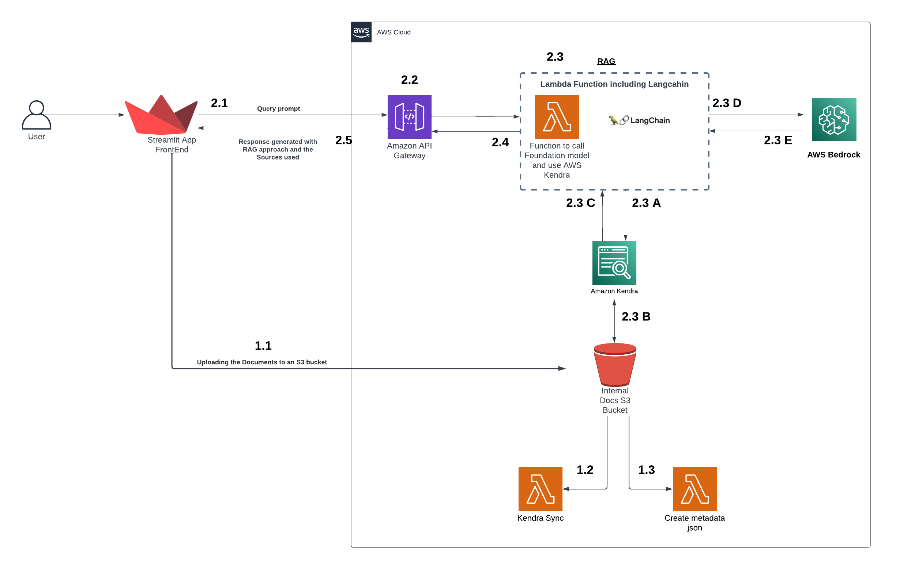
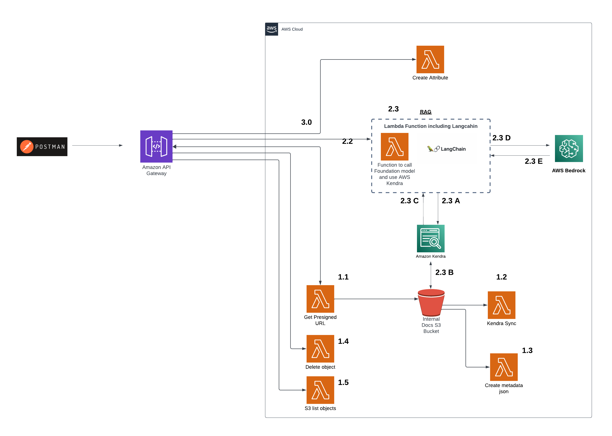

# PCH Generative AI solution
The “INquery” tool will allow Phoenix Children’s Hospital administrators to upload procedure pre-authorization guidelines to an Amazon S3 bucket as a central repository. Amazon Sagemaker Foundation AI generative model will be leveraged to generate embeddings while storing and querying the PDF documents. This will allow PCH administrators to efficiently use natural language while searching procedure specific insurance company pre-authorization guidelines, thereby reducing the time and resources required to verify information prior to medical procedures.

## Overview:-
Phoenix Children’s Hospital (PCH) has partnered with the Arizona State University Cloud Innovation Center (CIC) to build a tool that lets PCH administrators query medical documents using natural language processing.

## Description:-
For a large hospital, it is a challenge to categorize and query medical documents. Medical facilities allocate manual resources to sort through cluttered document systems which results in long lead times for administrative tasks and frustrating patient experiences. When the health of children is involved, an organized and easily accessible search system for medical documents can be invaluable. 

For example, insurance company guidelines on procedure pre-authorization are constantly changing. To prevent customers from unexpected charges or denial of claims, PCH administrators manually validate insurance websites for pre-authorization requirements for every procedure.

## High Level Architecture:-
The architectural diagram for full-stack application is: 

The architectural diagram for API's reference is:

# Prerequisites
For the prerequisites, we need: 

1. We need `npm` as package manager to install dependencies
   
2. `aws cdk` needs to be installed
   
3. `docker` to create lambda layers in aws cdk
   
4. Access to AWS Bedrock models that needs to be configured from aws console
   
5. IAM user with access to Bedrock service 

6. Key pair that you want to deploy to the EC2. 

# Deployment Guide:-
-> First we need to deploy the backend, then use the resources such as API to add to the Frontend.

Use `aws configure` to either select an existing profile or enter IAM access key and secret key to configure aws CLI

1. Enter the values in `.env` for these: 
   1. `AWS_ACCOUNT="XXXXXXXXXXX"` - Your AWS Account
   2. `AWS_REGION="us-east-1"` - AWS Region you want
   3. `KEY_NAME_VALUE` - key pair value for ec2 

2. Enter the values in `kendralangchainattribute.py` for these:
   1. `AWS_ACCESS_ID="XXXXXXXXXXXXXXXXXXXX"` - IAM Bedrock role access key
   2. `AWS_SECRET_ACCESS="XXXXXXXXXXXXXXXXXXXX"` - IAM Bedrock role secret key

3. After cloning the repo, go to the `Backend` folder.
4. Run the command `npm i` to install all the dependencies
5. Run the command `cdk synth` to start creating the cloudformation in the cdk.out folder
6. Run the command `cdk bootstrap` to bootstrap the project enviornment before deploying it.
7. Run the command `cdk deploy` to deploy the project and get the ouputs.
8. You will get three outputs: 
   1. API for Storage: `dev_get_preSignedURL_API`
   2. API for Kendra create Attribute: `dev_create_attribute_API`
   3. API for Query: `dev_llm_generate_attribute_api` 
   

-> Now, we need to deploy the frontend:

1. Go to the folder `Frontend`, and enter the vaalues in `.env` folder:
   1. `S3_ACCESS_KEY="XXXXXXXXXXXXXXXXXXX"`- IAM access key to access bucket
   2. `S3_SECRET_KEY="XXXXXXXXXXXXXXXXXXX"` - IAM secret key to access bucket
   3. `BUCKET_NAME="XXXXXXXXXXXXXXXXXXXXXXXXXXX"` - name of the bucket we created

2. Go to the folder `Frontend`, and enter the vaalues in `Query.py` folder:
   1. `LLM_api="XXXXXXXXXXXXXXXXXXX"`- the Query API we created in Backend

After creating a virtual env for python and activating it,
Now you can run `pip install -r requirements.txt` to install all the requirements locally

-> You can run the streamlit locally by running this command- `streamlit run Query.py`

-> For deploying it on EC2, you can follow instructions in the `/assets/docs/Deploying Streamlit App on EC2.pdf`

# User Guide:-

-> For the Users using Frontend:

The aplication has two Tabs: 

1. `Query`: This tab can be used by user to query the documents uploaded from the `Upload` tab. We can select the type of document we want to query from the left side as we define in the `Upload` tab.
   
2. `Upload`: This tab can be used by user to upload the document with a particular attribute. The specific attribute can later on be used to query with that attribute.

**Note**: To start the test you need to upload a file with a particular attribute. The time that needs to index a document depends on the size of the file, a small size of pdf file will take a few seconds but a file of 300 pages might take a few minutes.

-> For API documentation:

You can find the API documentation in the `/assets/docs/API_Postman_Guide.pdf` and follow theses steps to use APIs in your application as well as test in postman.

# Credits:-

Developer: 
    [Loveneet Singh](https://www.linkedin.com/in/loveneet-singh-6bb2851ba/)

Sr. Program Manager, AWS: 
    [Jubleen Vilku](https://www.linkedin.com/in/jubleen-vilku/)

Architect:
    [Arun Arunachalam](https://www.linkedin.com/in/arunarunachalam/)

General Manager, ASU: 
    [Ryan Hendrix](https://www.linkedin.com/in/ryanahendrix/)

This project is designed and developed with guidance and support from the [ASU Cloud Innovation Center](https://smartchallenges.asu.edu) and the City of Phoenix, Arizona teams.
